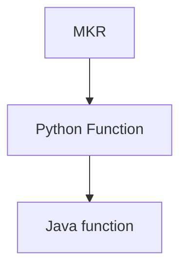

# Poker

Game State Representation
The vector could represent:

-> Player position (e.g., small blind, big blind).
-> Current pot size.
-> Betting actions (fold, call, raise).
-> Street (preflop, flop, turn, river).

🧠 What You’ll Get After Unzipping
You’ll likely see files like:

-> tree — could be a serialized or binary representation of a game tree
all possible game states or actions in a tree-like structure

-> board — likely stores board cards or configuration
The board file likely stores information about the game board state, such as the cards in a card game or positions on a board game.

-> storedstrategy — large file that probably holds actual solver output
This appears to be the largest file and seems to store the actual solver output. This could be a matrix, strategy table, or even a serialized data structure. It could be the most important file, as it contains the pre-calculated decisions or optimal moves based on the solver's calculations.

1. MKR Reverse File Engineering

- Files 0 and 1 may represent large data arrays (e.g., features or samples and their corresponding labels or keys).
- File 2 could be model-related data: probabilities, weights, scores, or other computed values.
- Files 3–19 may provide:

java -jar jdeserialize-1.2.jar subfiles/40bb-RIVER-BTNvBB-KQ2ss-bc-6x-xx-Kc/decompressed_file_2 \
| grep -oE '[0-9]+' > numbers_only.txt

